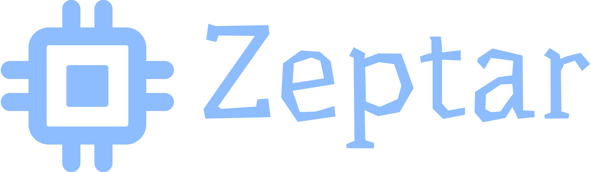
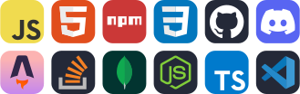
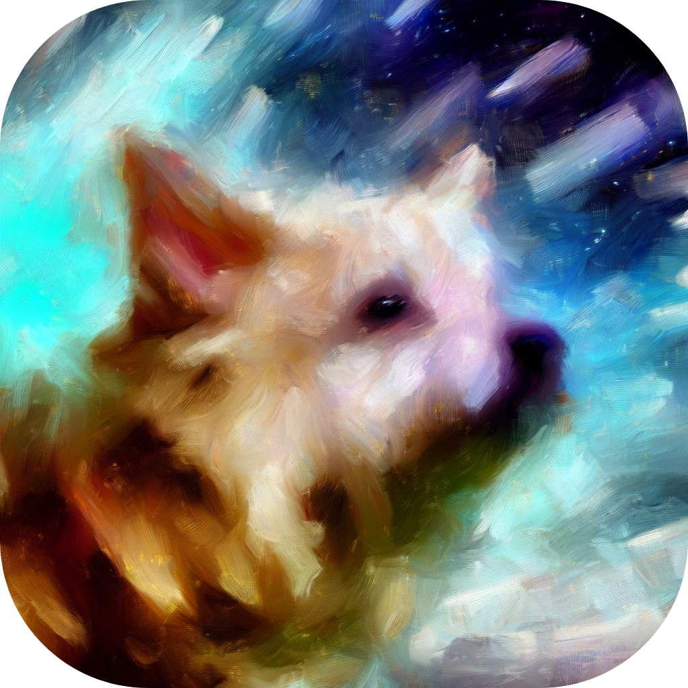
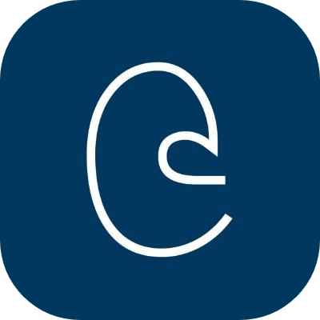
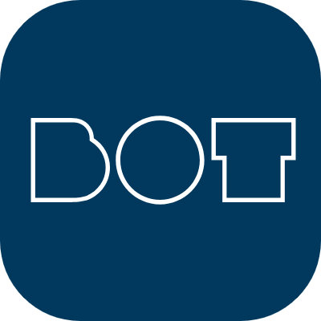

<div align="center">
    <p>
        <a href="https://zeptar.js.cool"></a>
    </p>
    <p>
        <a href="https://youtube.com/@thezeptar"></a>
        <a href="https://discord.com/users/1094120827601047653"></a>
        <a href="https://reddit.com/user/thezeptar"></a>
        <br />
        <a href="https://github.com/Zepvil"></a>
    </p>

---

###### ⭐ About Me

```yaml
> thezeptar
```

I've been a full-stack developer for about 2 years. My primary tools of choice include Node.js, JavaScript, Astro, and TypeScript. My current learning journey is centered on acquiring proficiency in the C programming language.

---

###### ⚡ Tools / Apps



---

##### 🚀 Projects

<div id="projects">
        </img>
        <a href="https://github.com/thezeptar/thezeptar"></img></a>
        <a href="https://github.com/keita-sama/spud.js"></a>
        <a href="https://github.com/ambushjs/ambush"></img></a>
        <a href="https://github.com/ambushjs/image"></img></a>
        <a href="https://github.com/ambushjs/bot"></img></a>
    </div>
</div>
